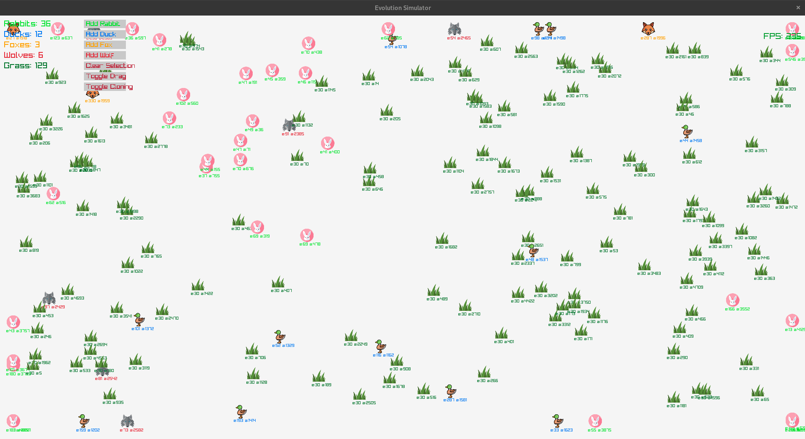

# Evolutionary Computation Simulator

## Description
This project provides a basic simulator with visuals for evolutionary computation, demonstrating concepts of natural selection and genetic algorithms.

## Screenshots


*Caption: Evolution simulation showing population adapting over generations*

## Details
There are 5 types of creatures in the food chain:
- Grass
- Rabbit
- Duck
- Fox
- Wolf

Grass randomly spawns on each frame.
Rabbits and ducks are herbivores and they eat grass.
Foxes eat ducks or rabbits.
Wolves are apex predators; they eat rabbits, ducks, or foxes.

When a creature comes close to another, an interaction will happen. One of them can consume the other, or they can reproduce if they are fit enough to do so. When 2 of the same species reproduce, they pass down the genetic code 50%-50%, but there is a chance of mutation in the process.

## Features
- Single-file C implementation
- Visual representation of evolving populations
- Configurable parameters for population size, generations, and mutation rate

## Contact
- Create an issue in the repository for questions or suggestions
- Email: alperatalayn@gmail.com

## Prerequisites
- Clang
- Make
- CMake

## Build Instructions
1. Clone the repository:
    ```sh
    git clone https://github.com/alperatalayn/evol.git
    ```
2. Navigate to the project directory:
    ```sh
    cd evol
    ```
3. Create and navigate to a build directory:
    ```sh
    mkdir -p build && cd build
    ```
4. Generate build files with CMake:
    ```sh
    cmake ..
    ```
5. Compile the project and return to main directory:
    ```sh
    make && cd ..
    ```

## Run Instructions
1. Execute the binary:
    ```sh
    ./evolution_sim
    ```
